```{r}
# library(ariadne)
# graph <- ariadne()
```

# !!! Coming soon !!! {style="text-align: center"}

## Very cool sticker {style="text-align: center"}

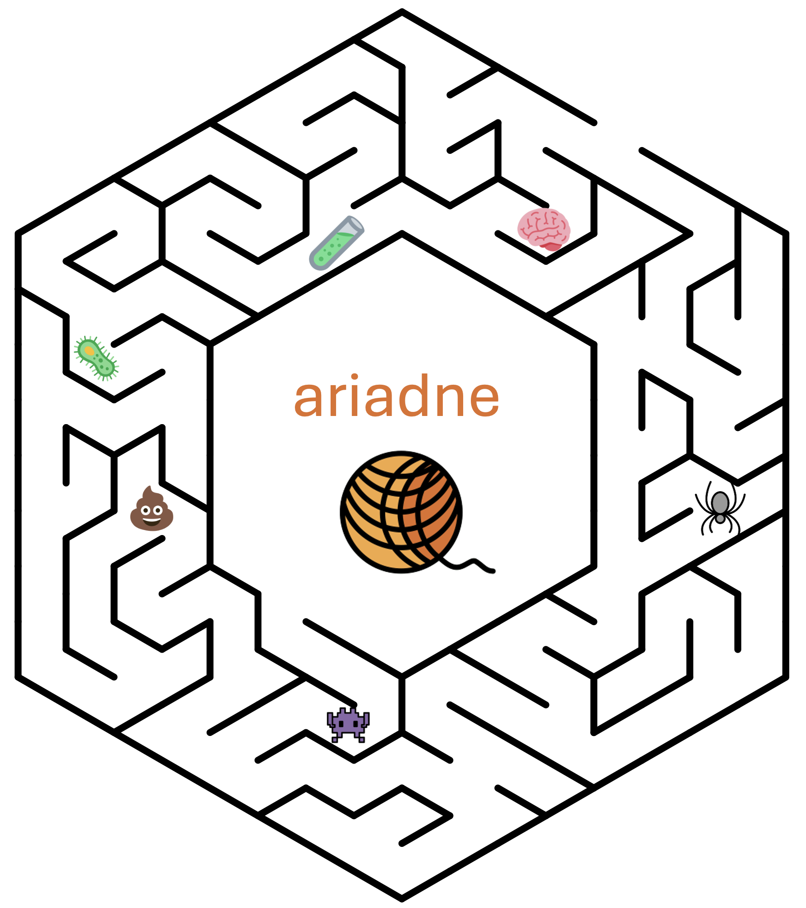{fig-align="center"}

## 4Frontiers of microbiome data science

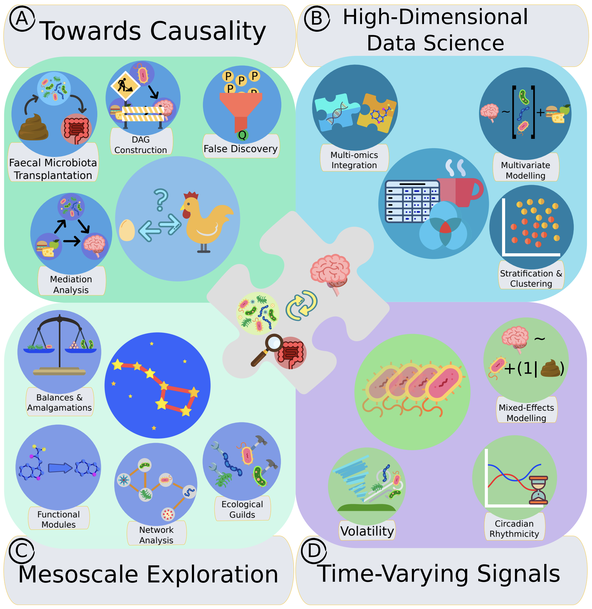{fig-align="center"}

## The [MinotauR](https://github.com/Minotau-R) in the room

Multi-modal INtegration Operations, Tools and AUxilaries in R

|   | package | description |
|------------------------|------------------------|------------------------|
| 🗃️ | [MultiFactor](https://github.com/minotau-R/MultiFactor) | S7 classes for relational data |
| 🧶 | [ariadne](https://github.com/minotau-R/ariadne) | Import and wrangle relational data |
| 🕷️ | [anansi](https://thomazbastiaanssen.github.io/anansi/) | Analysis of feature-pair interactions |
| 🦉 | [pallas](https://minotau-r.github.io/pallas/) | Compose and send SPARQL queries |
| ⛵ | [argonaut](https://github.com/minotau-R/argonaut) | Tools for stratified analysis |

## Databases are ...

:::::: columns
::: {.column width="33.3%"}
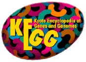{width="200" height="186"}
:::

::: {.column width="33.3%"}
{width="200"}
:::

::: {.column width="33.3%"}
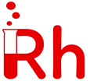{width="200"}
:::
::::::

## Databases are a wealth of knowledge!

:::::: columns
::: {.column width="33.3%"}
{width="200" height="186"}

Genome

-   genes & genomes

-   orthologues (KOs)

-   pathways
:::

::: {.column width="33.3%"}
{width="200"}

Proteome

-   unique proteins

-   protein clusters

-   redundant prots
:::

::: {.column width="33.3%"}
{width="200"}

Reactome:

-   reactions

-   enzymes (EC)

-   compounds
:::
::::::

## Time for a poll!

1.  What databases do you use in your research?

2.  Have you had any challenges using databases?

{fig-align="center" width="1000"}

## but they aren't always easy to use

::::: columns
::: {.column width="50%"}
Loading...

{width="200"}

Same data, different formats

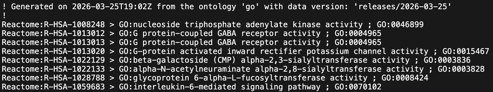

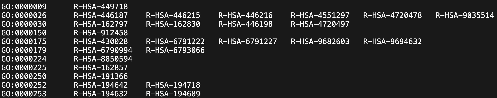
:::

::: {.column width="50%"}
Large data volumes

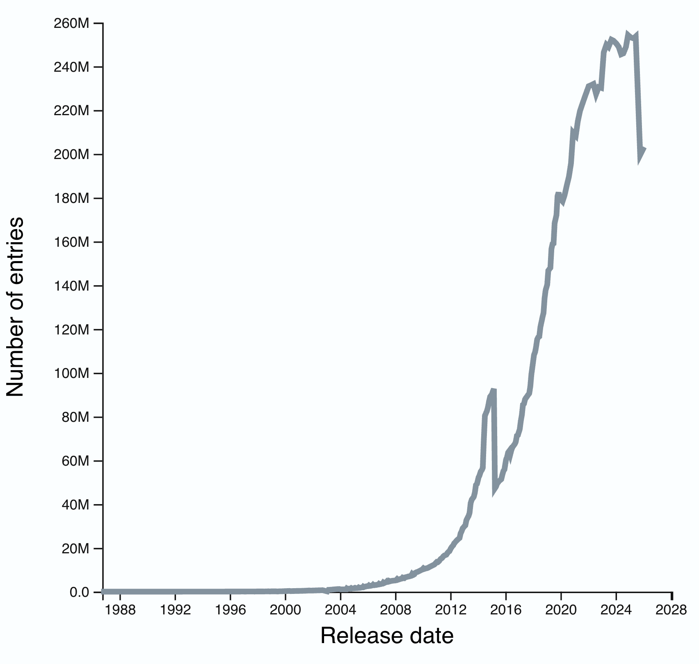{width="500"}
:::
:::::

## How it works

{fig-align="center"}

## Databases are ...

:::::: columns
::: {.column width="33.3%"}
{width="200" height="186"}
:::

::: {.column width="33.3%"}
{width="200"}
:::

::: {.column width="33.3%"}
{width="200"}
:::
::::::

## Databases are networks!

:::::: columns
::: {.column width="33.3%"}
{width="200" height="186"}

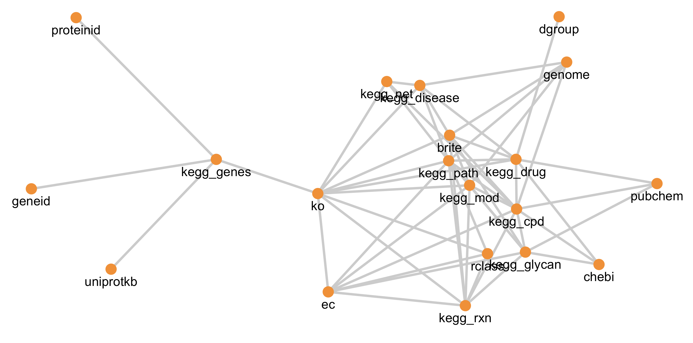{width="300"}

```{r}
# plotPath(graph, res.name = "KEGG")
```
:::

::: {.column width="33.3%"}
{width="200"}

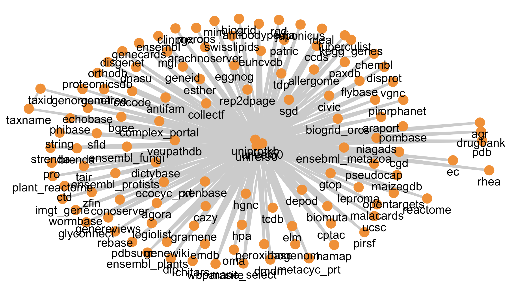{width="300"}

```{r}
# plotPath(graph, res.name = "UniProt")
```
:::

::: {.column width="33.3%"}
{width="200"}

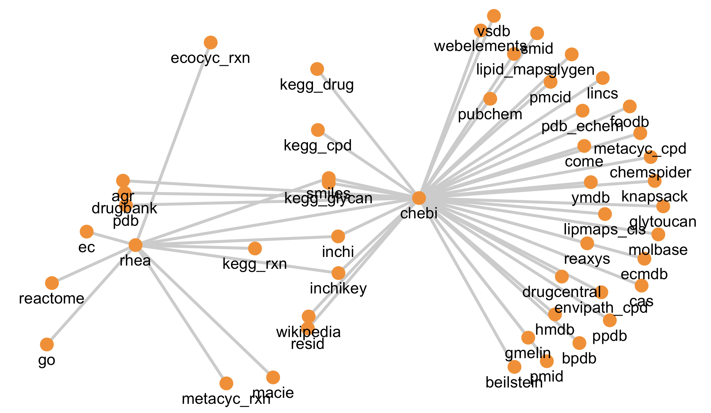{width="300"}

```{r}
# plotPath(graph, res.name = "Rhea")
```
:::
::::::

## Connecting the dots

"The sum of the parts is greater than the whole"

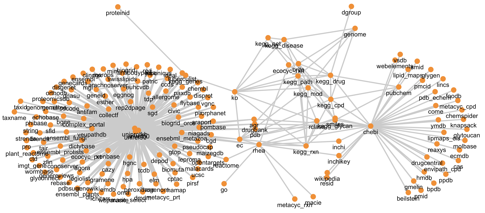

## Taking a walk

across the ariadne graph

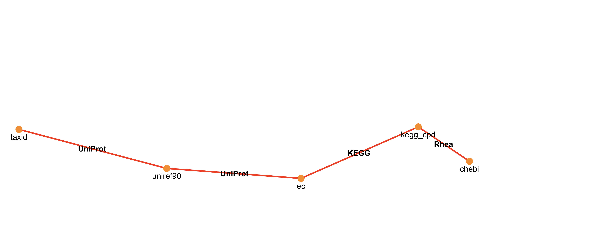

## Output

Links between origin and target

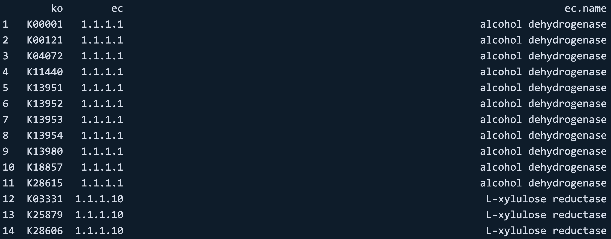

## Other nice features

-   Add user-defined resources

```{r}
#| echo: true
#| eval: false
# # So much relational data in the wild!
graph <- addResource(graph, res.url, "MyDatabase")
```

-   Work with Bioconductor classes

```{r}
#| echo: true
#| eval: false
# Add modules membership info to SummarizedExperiment
se <- addModules(se, ariadne.out, as = "names")
```

-   Perform module-wise operations

```{r}
#| echo: true
#| eval: false
# Calculate functional phylogenetic alpha diversity
se <- applyByModule(se, "rows", mod.names, getAlpha, index = "faith")

# Agglomerate assay based on module membership
se <- agglomerateByModule(se, mod.names, as = "names")
```

## Use cases

Use ariadne to retrieve and combine relational information from multiple databases, and integrate it with your data.

In practice:

-   Functional annotation (ChocoPhlAn, WoL)

-   Module-wise analysis (alpha, beta, DE)

-   Gene/Microbe-set enrichment analysis (MSigDB, BugSigDB)

-   Pathway enrichment analysis (KEGG, Rhea, MetaCyc)

## Next steps

-   Prepping submission to Bioconductor (forging nice logo)

-   Spreading the word (manuscript, EuroBioC poster & talk)

-   Adding features (use cases, app/website, Python extension)

Wanna join the adventure?

## Acknowledgements

-   the Turku Data Science Group

-   Co-developer: Thomaz Bastiaanssen

-   Testers: Vilhelm Suksi and Eugenia Natasha

## Resources

-   [Bugs as features](https://www.nature.com/articles/s44220-023-00149-2){target="_blank"}

-   [MinotauR GitHub Org](https://github.com/Minotau-R){target="_blank"}

-   [OpenMoji](https://openmoji.org/){target="_blank"}

## Code

```{r}
#| echo: true
#| eval: false
# Import resource graph
graph <- ariadne()

# Plot resource graph
plotPath(graph, res.name = c("KEGG", "UniProt", "Rhea"))

# Plot path
plotPath(graph, taxid ~ chebi, k = 19, focus = TRUE)

# Search for alternative pathways
searchPath(graph, taxid ~ chebi, k = 30)

# Get pathway description for reproducibility
drawPath(graph, taxid ~ chebi, k = 19)

# Link taxa to compounds
tax2chebi <- weavePath(graph, taxid ~ chebi, k = 19, init = c(some_taxid))
```
